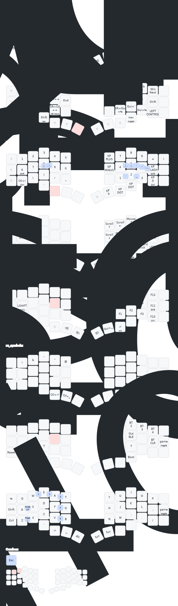

 

# [fuji44.keymap](https://github.com/mksmpc/zmk-config-fuji44/blob/main/config/fuji44.keymap)

Tools:
- [Corne | QWERTY - KeymapDB](https://keymapdb.com/?firmwares=ZMK&baseLayouts=QWERTY&keyboard=Corne)
- [Keymap Editor](https://nickcoutsos.github.io/keymap-editor/)
- [Keymap Drawer · Streamlit](https://keymap-drawer.streamlit.app/?zmk_url=https%3A%2F%2Fgithub.com%2Fmksmpc%2Fzmk-config-fuji44%2Fblob%2Fmain%2Fconfig%2Ffuji44.keymap)

> Drawn with [@caksoylar's Keymap Drawer](https://github.com/caksoylar/keymap-drawer)

---

## Resources

- [ZMK Firmware GitHub](https://github.com/zmkfirmware/zmk)
- [ZMK Documentation](https://zmk.dev/docs)
